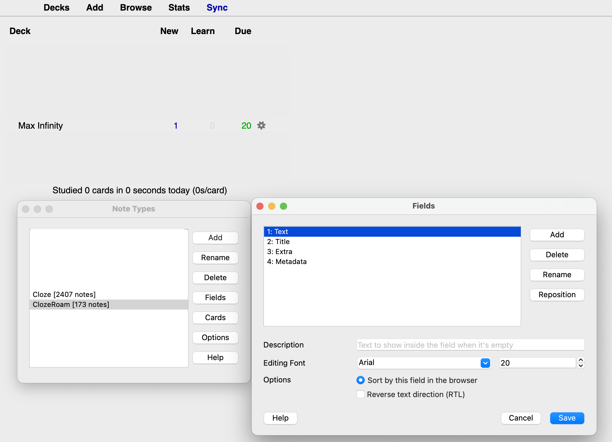

# Fabricius (roam-to-anki v2)
> _Connecting the east side of the city to Tiber Island since 62 BC, the Pons Fabricius (Fabricius Bridge) is the oldest bridge in Rome to survive to the present day. - Wikipedia_

*Fabricius* is a Roam Research plugin that allows bidirectional sync with Anki. The goal is to have robust, fast syncing for the most common use-cases.


**Disclaimer:** This software is provided as-is and you are responsible for your data. While we have tested this library as far as possible, there may still be bugs. You should keep backups of both Roam and Anki data.

## Getting started (Roam Depot)

*Setup takes about five minutes and is totally worth it!*

1. Install the [AnkiConnect](https://ankiweb.net/shared/info/2055492159) plugin for Anki.
2. Configure AnkiConnect: Go to `Anki -> Tools -> Addons -> Anki Connect -> Config` and amend `webCorsOriginList` to include `https://roamresearch.com`
3. Create an Anki note type based on Cloze named `ClozeRoam`. It needs to have the fields `Text`, `Metadata`, `Extra` and `Title`. Upon syncing, notes will be created in a deck named `Max Infinity`, which has to exist. 
   - 
4. Modify the template for the note type to look something like this:

```html
<!-- front -->
<div class='roamtitle'>{{Title}}</div>
<div id="extra">{{Extra}}</div>
{{cloze:Text}}

<!-- back -->
<div class='roamtitle'>{{Title}}</div>
<div id="extra">{{Extra}}</div>
{{cloze:Text}}
```
5. Before clicking on the [Sync button](sync-button.png), Anki must be running. Sync is fastest if Anki is running in the foreground.
6. If cards don't sync, it's likely because Anki has been in the background for too long. Try syncing again after switching it to the foreground.

## Getting started (`roam/js` install)

- Like any other client-side javascript plugin, install `dist/browser.js` in a javascript code block nested under a `{{roam/js}}` block. You will see a new sync button in your top navbar.
- There are more constants (deck, note type etc.) that can be tweaked at the top of the js script. Due to Typescript compilation, these config variables may be located further down in `browser.js`. Please look at `src/config.ts` to see the available variables and their names.
- Rest of the instructions are the same as for Roam Depot.

## Recommended use

The recommended use is to create simple Q&A cards in Roam using the provided cloze functionality. For instance, you may be taking notes about an article or book you are reading. For each section of your notes in Roam, you could create a block for flashcards like so:

```text
- How to cook onion soup
  - Onion soup is great...
  - Onion Soup Recipe #[[srs/cloze-g]]
    - Q: What is the cook time?
      A: {c1:20 minutes}
    - Q: How many onions should I use?
      A: {c1: 2 per person.}
  - Other tips:
    - ...
```

This will create two flashcards.

## Caveats and Limitations
- Don't edit the sync metadata on the Anki note.
- The Roam block UID is used to identify the corresponding note in Anki. Avoid taking actions which cause the block UID of a Roam block to change.
- You can't create a new note in Anki and sync it to Roam.
- There is no garbage collection for unused notes in Anki (yet).
- If the same uid is updated in both Roam and Anki, Roam will be taken as the source of truth.
- Changes to group tags and title tags do not cause a sync for clozes blocks underneath them. The actual cloze block must be updated.

## Advanced

### Single block clozes
If we have the following text in a Roam block with block id `f-123`:
```text
    - "In [[C]], we can have {c2:indirect references} to variables are using {c1:[[pointers]]} #srs/cloze"
```

we get this note in Anki with Text = 
```
In [[C]], we can have {{c2::indirect references}} to variables using {{c1::[[pointers]]}} #srs/cloze
```

and Metadata = `f-123`.

- This assumes the default configuration of browser.js
- Note the modified cloze syntax, since Roam reserves `{{}}` and `::` for internal use. 
- Please see [Anki docs](https://docs.ankiweb.net/templates/generation.html?highlight=cloze#cloze-templates) for more info on how a cloze note type needs to be configured (easiest is to clone the built-in Cloze note type).

Title tags provide context to 

### Group and Title Tags - Pull in more context!

*Title tags* provide context for any nested blocks. *Group tags* augment title tags by providing extra context for a block from the *closest* context-providing block. The default title tag is `#srs/cloze-t` and syncs to the `Title` field. The default group tag is `#srs/cloze-g` and syncs to the `Extra` field.

So something like this in Roam:
```text
    - Stimulants #srs/cloze-t
      - Caffeine #srs/cloze-g
          - Tastes bitter.
          - Is an {c1:adenosine} antagonist.
          - Adenosine antagonists #srs/cloze-g
            - bind to adenosine receptors with no {c1:physiological effect}.
          - Has a half-life of {c1:5} hours.
```

Would create 3 cloze notes.

```
Title: Stimulants
Text: Is an {{c1::adenosine}} antagonist.
Extra: Caffeine
```

```
Title: Stimulants
Text: Has a half-lfe of {{c1::5}} hours.
Extra: Caffeine
```

```
Title: Stimulants
Text: Bind to adenosine receptors with no {{c1::physiological effect}}.
Extra: Adenosine antagonists
```

Specifically, group tags work in the following way:

1. Any child blocks (direct or indirect) under a block with a **group tag** is considered a cloze, unless there are no cloze marks `{c1:...}` on it.
2. Clozes generated from said child blocks automatically include context from the **closest parent** block.